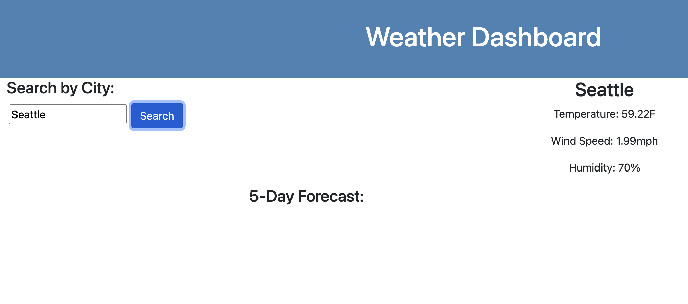

# hw6-weather-dashboard
Server-Side APIs

## Elevator Pitch
---
A weather dashboard that allows the user to search the weather forecast based on cities.  

  

## Application
---
1. Enter city name in search bar
2. Desired cities forecast is displayed 
3. City name is stored in local storage  

## Future Improvements
---
* Store searched cities in local storage
* Display 5 day forecast 
